# Scale's Image Manipulation Program
https://www.bhasvic.ac.uk/media/pdf/computer-science-al-170844-specification-accredited-a-level-gce-computer-science-h446-874.pdf

---

## <u>Table of Contents</u>
- [Analysis of the Problem](#Analysis-of-the-Problem)
    - [Problem Identification](#Problem-Identification)
        - etc (fill this at the end, im sure intellij doesn't have a thing to auto fill it)


# Analysis of the Problem
## Problem Identification
I am creating an image manipulation program.
This is a type of program which allows the user to scale, crop, rotate and draw on existing images or a blank canvas to produce new images.
This project is amenable to computational methods due to the possibility of performing actions which are challenging on paper.
This includes erasing parts of an image and editing separate layers, which is why graphic design jobs require an image manipulation program.
The aim of this project is to create a program which is straightforward to learn and use, yet still capable of complex image manipulation.
Image manipulation programs are useful for professional jobs requiring image creation and tweaking as well as hobbyists pursuing creative projects.
Since the program is intended to be used by a wide range of people, responses from users are imperative to the success of the project.

## Stakeholders
My project is made to be used as a general purpose image manipulation project.
This means that there is variety in the skill level and features of my stakeholders which all need to be considered.
Both hobbyists and professionals need to be accounted for when creating the project; this means features should be easily accessible with a high skill ceiling.
Different fields of creativity, such as graphic designers and artists, can be accounted for separately; however, it is challenging to create a program simple enough for beginners and complex enough for experts.
### General Purpose
- Being able to draw and erase is useful for artists and designers
- Cropping and scaling images are useful outside creative jobs, such as teachers wanting to resize handouts.
- Adding text to images is desired for news publications creating a lead image
### Hobbyists
- They will require a simple GUI which is straightforward to navigate on first use
- Runs well on low-quality setups as hobbyists do not necessarily have good hardware
- Everything should be easy to understand without guides
- Functions should be intuitive with experimentation with configuration
### Professionals
- Each action should be configurable to meet any desires of the user
- Complex effects should be easily applicable to the image
- Documentation should be written to assist professionals in finding how their desired goal is achievable

## Research
### GNU Image Manipulation Program (GIMP)
GIMP is a popular open source image manipulation program which is capable of complex effects.
It allows the user to perform any image manipulation they can imagine, as simple as cropping and as complex as blur and antialiasing.
The program has 10 headers which each have hundreds of options below them which allow the user to alter the image in some way.
The sidebar contains 16 modes, each containing submodules, which, when clicked, change the operation the cursor performs.
All these settings mean that with enough practice there are more than enough tools to do whatever is needed to an image.
An issue with all this customisation is that the GUI is cluttered.
There is far too much showing on the screen, which makes navigating the GUI extremely difficult and overwhelming to new users.
Finding specific features is a chore as the headings have subheadings not particularly related to the heading.
Each setting is far too configurable with many of the settings not having a use case or explanation.
Some settings which are extremely useful are only able to enable by keybinds.
Switching your cursor to be able to draw with the "pencil" mode is only possible by pressing N, which is only shown to the user when they hover over the paintbrush icon.
The app does come with a help section, however, I believe that it should be possible to create a program which is intuitive and does not require a help tab.
The program is not lightweight, it takes several seconds to a minute to start up as well as not running particularly well.
Below is a screenshot of the program.


### Microsoft Paint
Microsoft's Paint program is the opposite end of the spectrum.
Paint is lightweight, launching without a noticable delay and features a very user friendly GUI.
It allows the user to draw on, crop, scale and rotate the image.
The GUI is very simple and easy to navigate, not requiring any help.
Paint is much less customizable than GIMP, features usually do not have many settings.
For example, when scaling an image, antialiasing is forcefully enabled, which can cause images to look blury.
Complex effects such as blurring are not a feature, and oddly opacity is applied seperately to the colour picker.
The GUI only features buttons at the top, which is compact and means you do not need to search through seperate GUI's to find the setting you are searching for.
Below is a screenshot of the program.


## Problem Solution
The research done prior has informed me of the possible pitfalls of my project.
GIMP struggles with user-friendliness due to its verbosity, having buttons not described and common features hidden from easy access.
Paint struggles with the opposite, all the features are easily accessible, however, it allows very little to be done, making some simple image manipulation hard or impossible.
The layout of Paint is very nice, however, I believe it is still bloated compared to the number of features provided. GIMP has many useful features which, while complicated at first, are required for a useful program.
I believe that GIMP’s idea of each button having sub-buttons is a good idea for the compactness of the GUI.
I believe the optional sub-settings should be accessible but not forced to be configured on each use.
For my solution to thrive, I will need to narrow down essential features.

### Language choice
I will be using Java as my language of choice.
Java is an object-oriented language, allowing for easier maintainability and reusability of code.
It is compiled, which allows for faster execution as code optimisation can be performed at compile time.
The language is also cross-platform as the compiled java bytecode is interpreted to machine code by the Java Virtual Machine (JVM).
This means that the program can be written once and run on any operating system which supports the JVM.
It comes with a large standard library, which allows for a wide range of features.
This includes JavaFX, which is a framework which allows the user to create a GUI in a simple and intuitive way.

### Problem Limitations
The program is made with many different stakeholders' ideals at heart.
They can each have conflicting desires, which makes it difficult to satisfy everyone.
Some users require a much wider range of specified features, which either are not essential or could take too much time.
Since the program is being developed alone, time is a large limitation.
Abstraction must be used to cull unnecessary features, and complex effects may be outside the timescale or outside my skill set.
Image manipulation is a new field of research for me, which means that I will need to learn the basics for this project, which is another factor which takes time away.

### Success Criteria
|      Criteria      | Description                                     |
|:------------------:|-------------------------------------------------|
|      Drawing       | Using the mouse to draw on an image             |
|    Cursor Size     | Change the area the cursor effects              |
|       Colour       | Change the colour the cursor draws              |
|        Fill        | Fill in sections of the image in a single click |
|       Layers       | To edit different layers of an image            |
|      Erasing       | Erasing parts of an image                       |
|      Cropping      | Change the size of the image without scaling    |
|        Text        | Allows for text to be added to an image         |
|      Scaling       | Change the image to be smaller                  |
|       Moving       | Moving parts of an image easily                 |
|      Rotating      | Should be able to rotate the image              |
|     Importing      | Able to import images into the program          |
|     Exporting      | Able to export images from the program          |
| Usability Features | Keybinds like undo and redo                     |

# Design of the Solution
## Decomposition
<!--Break down the problem into smaller parts suitable for computational solutions justifying any decisions made.-->
The program will be structured into subproblems which will be solved in turn.
- GUI
    - Initialising
    - Toolbar
        - Pencil
        - Fill
        - Select
        - Colour picker
    - Canvas
    - Transforming the canvas
        - Zooming in/out
        - Moving the canvas
- Handling Inputs
    - Clicking on elements of the GUI
        - Appropriately changing the cursor's position relative to transformations of canvas
    - Keyboard input
        - CTRL+Z / CTRL+Y
        - CTRL+C / CTRL+V / CTRL+X
        - CTRL+A
        - CTRL+S
- Manipulating Images
    - Scaling
        - Cropping
        - Rotating
        - Drawing
- Saving Images

## Solution Description
### Justification of Structure
<!--Explain and justify the structure of the solution.-->
To come to this conclusion, I had to use computational thinking.
Abstraction, Decomposition and Problem Recognition are all computational methods.
#### Abstraction
Abstraction is the process of hiding the complexity of a problem by simplifying it.
This is done by removing unnecessary details from the problem and replacing them with simpler, more abstract terms.
For example, this program does not need to worry about the difficulties of creating a GUI from scratch, as JavaFX can handle this for us.

#### Decomposition
This program has been divided into subproblems which will be solved in turn, this is known as decomposition.
Each element can be solved independently, and the program can be built up from these subproblems.
It makes sense to tackle these subproblems from their smallest parts and then build up the program from there.

#### Problem Recognition
Each subproblem can be recognisable as a problem, which has previously been solved before.
Problem recognition can clarify the problem and how it is possible to be solved by computational methods.
It allows me to compare new problems to previously solved problems and see how they relate to each other and saves me from reinventing the wheel.
For example, Java comes packaged with a data type which can store an image, which saves me making my own image class.

<!--Describe the parts of the solution using algorithms justifying how these algorithms form a complete solution to the problem.-->
#### GUI
Creating the window is simply handled by the JavaFX framework.
An object with the JFrame class is created, and within the main function its "setVisible" method is called to display a blank GUI.
A size needs to be set, as it defaults to 0x0.
The window is centered on the screen by setting its position relative to null, it defaults to the top left of the screen.
The close operation needs to be set, which tells the program to end when the GUI is closed.
```java 
private static final JFrame FRAME = new JFrame("window title");

public static void main(String[] args) {
    FRAME.setSize(1000, 1000);
    FRAME.setLocationRelativeTo(null);
    FRAME.setDefaultCloseOperation(JFrame.EXIT_ON_CLOSE);
    FRAME.setVisible(true);
}
```
Drawing to the window is more challenging.
The frame can be directly drawn to via its graphics library.
However, drawing directly to the screen can cause flickering between frames, which is undesirable.
The solution is to draw to create a buffer of the window and draw to the buffer.
When the buffer is ready to be displayed, the buffer is drawn to the screen.
The below code is an example code for drawing a moving rectangle to the screen.
```java
private static BufferStrategy getBufferStrategy() {
    FRAME.createBufferStrategy(2);
    return FRAME.getBufferStrategy();
}
private static Graphics2D getGraphics() {
    return (Graphics2D) getBufferStrategy().getDrawGraphics();
}

private static void drawLoop() {
    while (true) {
        getGraphics().drawRect((int) System.currentTimeMillis() % (FRAME.getWidth()-100), (int) System.currentTimeMillis() % (FRAME.getHeight()-100), 100, 100);
        getBufferStrategy().show();
    }
}
```
With just these steps, we can now already draw all the GUI needed with relative ease.
I believe it makes most sense to draw the canvas first, as it should be drawn below other parts of the interface, drawing it first allows for us to draw over it later.
Inputs should be able to modify the canvas, so those transformations should be undone before rendering other UI elements.
The toolbar can then be drawn on top of the canvas.
Below is an example code to draw a toolbar and a canvas.
```java
public static void drawUI() {
    drawCanvas();
    drawToolbar();
}

private static void drawCanvas() {
    Graphics2D g = getGraphics();

    // save the default transform so we can restore it later
    AffineTransform defaultTransform = g.getTransform();
    
    // move the canvas to where it should be drawn, these variables can be modified by the user
    g.translate(CANVAS_X, CANVAS_Y);
    g.scale(CANVAS_SCALE_X, CANVAS_SCALE_Y);

    // draw 500x500 rect, it will be scaled and translated to the correct position by the library.
    g.drawRect(0, 0, 500, 500);
    
    // restore the default transform
    g.setTransform(defaultTransform);
}

private static void drawToolbar() {
    // draws a rectangle which is 100 pixels high and fills the entire width of the frame
    getGraphics().drawRect(0, 0, FRAME.getWidth(), 100);
}
```

#### Handling Inputs
Inputs to the GUI can be easily handled by the JavaFX framework.
When the GUI is created, append a listener for the mouse/keyboard events.
This is done by creating a class which extends the MouseListener/KeyListener interfaces.
The listener will then be called when the event occurs.
Below is an example of a listener which prints the coordinates of the mouse when it is clicked.
```java
public class MouseListener implements java.awt.event.MouseListener {
    @Override
    public void mouseClicked(MouseEvent e) {
        System.out.println("Mouse clicked at: " + e.getX() + ", " + e.getY());
    }
}
```
The mouse listener will need to keep track of the current state of the UI.
For the keyboard listener, keys such as CTRL+Z will need to be fed a previous state of the UI to restore.
CTRL+V will need to access the clipboard, and CTRL+A will need to select the image.
Each of these keybinds needs access to the state of the canvas, so the canvas state should be a global variable.

#### Manipulating Images
Manipulating images can be done by using the Java ImageIO library.
This library allows for the reading and writing of images in a variety of formats.
Reading images is required for editing pre-existing images, and writing images is required for saving images.
The library also allows for the manipulation of images, such as drawing, scaling, cropping, rotating and drawing.
Below is an example of how to draw to an image. The image fed to the function will have a rectangle drawn to it.
```java
public static void drawRectToImage(BufferedImage image, int x, int y, int width, int height) {
    Graphics2D g = image.createGraphics();
    g.setColor(Color.RED);
    g.fillRect(x, y, width, height);
    g.dispose();
}
```
The following code can then save the resulting image to a file.
```java
public static void saveImage(BufferedImage image) throws IOException {
    ImageIO.write(image, "png", new File("image.png"));
}
```

With just these small steps, it is already possible to create a UI, handle an input, manipulate an image and output the modified image.

<!--TODO: Describe usability features to be included in the solution-->

## Key Variables
<!--Identify key variables / data structures / classes justifying choices and any necessary validation.-->
| Variable         | Type                            | Description                                                        |
|:-----------------|:--------------------------------|:-------------------------------------------------------------------|
| `FRAME`          | `JFrame`                        | The frame which is drawn to                                        |
| `MouseListener`  | `class extending MouseListener` | Class listening for and responding to mouse inputs                 |
| `KeyListener`    | `class extending KeyListener`   | Class listening for and responding to key inputs                   |
| `FRAME_GRAPHICS` | `Graphics2D`                    | The graphics context of the canvas, allows us to draw to the image |
| `CANVAS_IMAGE`   | `BufferedImage`                 | The image being manipulated.                                       |
| `CANVAS_X`       | `int`                           | The x position of the canvas.                                      |
| `CANVAS_Y`       | `int`                           | The y position of the canvas.                                      |
| `CANVAS_SCALE`   | `double`                        | The scale of the canvas.                                           |
| `ELEMENT`        | `Element`                       | Abstract parent class for interactable elements                    |
| `ELEMENTS`       | `List of Element's`             | List of elements, used for handling them                           |
| `CURSOR`         | `Cursor`                        | Abstract parent class for usable cursor types                      |
| `CURSORS`        | `List of Cursor's`              | List of cursors, used for handling them                            |
| `CHANGES_BUFFER` | `Buffer of BufferedImages`      | Stores previous changes to the file for CTRL+Z to work             |

## Testing
<!--Identify the test data to be used during the iterative development and post-development phases and justify the choice of this test data.-->
| Test Data                          | Reason                                                                          |
|:-----------------------------------|:--------------------------------------------------------------------------------|
| Large Image                        | Test RAM usage and performance of the program                                   |
| Small Image                        | Test the program's ability to handle scaling small images to be drawable on     |
| CTRL+Z with no undo history        | Tests if the program handles the history being a null pointer                   |
| Clicking outside image bounds      | Tests if the program correctly handles the mouse being outside the image bounds |
| CTRL+V with invalid clipboard      | Tests if the program handles the clipboard being a null pointer                 |
| Resizing image to be negative size | Tests if the program handles the image being resized to a negative size         |

# Development
## Prototype 1
### GUI
The first stage of development is creating a GUI which I can draw to.
In Main.java I created a global constant which of the GUI
```java
private static final JFrame FRAME = new JFrame();
```
When the program is run, I initalise the GUI with the "initialiseGUI" function shown below
```java
private static void initialiseGUI() {
    // frame size
    FRAME.setSize(1000, 500);
    // centres frame on screen
    FRAME.setLocationRelativeTo(null);
    // closes the program when the window is closed
    FRAME.setDefaultCloseOperation(JFrame.EXIT_ON_CLOSE);
    // makes the frame visible
    FRAME.setVisible(true);
    // create a frame buffer, which will be drawn to as opposed to drawing directly to the screen
    FRAME.createBufferStrategy(2);
}
```
Then I call the main draw loop. The code below draws a moving rectangle to the screen at 60 frames per second.
```java
// constant value for time between frames being rendered
private static final int FRAME_TIME_GAP = 50;
// variable to save the time the last frame was drawn at
private static long lastFrameMS = 0;

private static void drawLoop() {
    BufferStrategy bufferStrategy = FRAME.getBufferStrategy();
    
    while (true) {
        // drawing the program with a frame cap makes the program run smoother than attempting to draw every frame
        if (System.currentTimeMillis() - lastFrameMS < FRAME_TIME_GAP) continue;
        // create graphics
        g = (Graphics2D) bufferStrategy.getDrawGraphics();
        
        // reset screen
        g.clearRect(0, 0, FRAME.getWidth(), FRAME.getHeight());
        // filler rendering, to test if it is working
        g.fillRect((int) System.currentTimeMillis() % (FRAME.getWidth()-100), (int) System.currentTimeMillis() % (FRAME.getHeight()-100), 100, 100);
        
        // the drawing is finished, display the buffer
        bufferStrategy.show();
        // dispose of graphics from this buffer to free up its memory
        g.dispose();
        
        // save time the frame is drawn at
        lastFrameMS = System.currentTimeMillis();
    }
}
```
This leaves us with a GUI which looks like this.

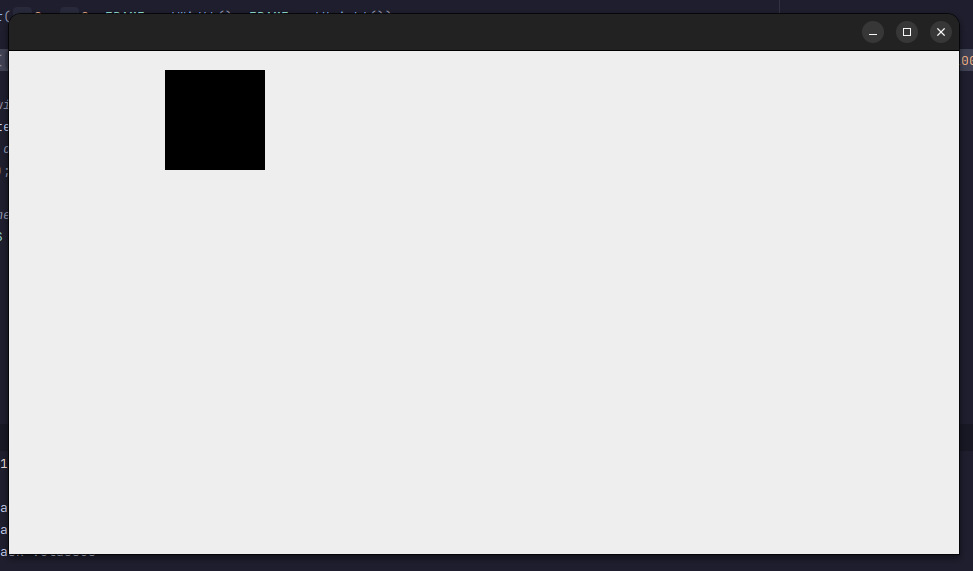

### Canvas
To draw a canvas, we create a BufferedImage.
```java
public static BufferedImage CANVAS_IMAGE = new BufferedImage(FRAME.getWidth(), FRAME.getHeight(), BufferedImage.TYPE_INT_ARGB);
```
We can then draw this image within the draw loop.
```java
private static void drawLoop() {
    // ...
    g.drawImage(CANVAS_IMAGE, 0, 0, null);
    // ...
}
```
For future use, I have created variables which control where the canvas is drawn at.
```java
public static int CANVAS_X, CANVAS_Y;
public static double CANVAS_SCALE = 1;

public static void drawCanvas() {
    // store previous transformations
    AffineTransform currentTransform = g.getTransform();
    g.translate(CANVAS_X, CANVAS_Y);
    g.scale(CANVAS_SCALE, CANVAS_SCALE);
    
    // draw canvas
    g.drawImage(CANVAS_IMAGE, 0, 0, null);

    // restore previous transformations
    g.setTransform(currentTransform);
}
```
Now the GUI will display the drawing held in the BufferedImage CANVAS_IMAGE every 50 milliseconds.
The image cannot yet be edited, however.

### Mouse Inputs
For the program to listen for the mouse dragging across the screen, the JFrame requires a MouseMotionListener.
```java
private static void initialiseGUI() {
    // ...
    FRAME.addMouseMotionListener(new MouseMotionListener());
}
```
The MouseMotionListener class is shown below. When the mouse is dragged, the pixel at the mouse's position is set to red.
```java
public class MouseMotionListener extends MouseAdapter {
    @Override
    public void mouseDragged(MouseEvent e) {
        Canvas.IMAGE_GRAPHICS.setColor(Color.RED);
        Canvas.IMAGE_GRAPHICS.fillRect(e.getX(), e.getY(), 1, 1);
    }
}
```
This works fine when the mouse is dragged slowly, as shown below:

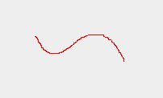

However, when the mouse is moved quickly, there are clear gaps:

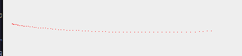

This happens because the mouseDragged MouseEvent is not called for each pixel the mouse has moved.
The event is called when a change is detected in the mouse movement.
With a high DPI mouse, it is possible to move the mouse more than a pixel before the listeners detects the movement, causing the holes.
To fix this issue, I store the position of the previous mouse movement, and draw a line from the previous position to the current position.
```java
private static int lastX, lastY;
public void mouseDragged(MouseEvent e) {
    // ...
    lastX = e.getX(); lastY = e.getY();
}
```
This fixes the issue, and the line is now drawn smoothly.

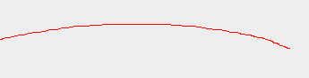

However, the lastX and lastY variables are not unset when the mouse is released.
This means that upon next pressing the mouse, the line interpolates from the previous.
This is also most visible as lastX and lastY default to 0, causing the first line to interpolate from 0,0 as shown below.

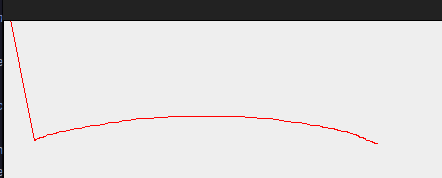

To fix this, we need to know if this is the first frame of the mouse being pressed, and if it is, do not interpolate it.
This requires knowing when the mouse is released and setting the values to -1,-1 to indicate that they should not interpolate.
To do this, I created a MouseListener which notifies the program when the mouse is released, as shown below.
```java
public class MouseListener extends MouseAdapter {
    @Override
    public void mouseReleased(MouseEvent e) {
        MouseMotionListener.setLastMouseDragX(-1);
        MouseMotionListener.setLastMouseDragY(-1);
    }
}
```
Then in the MouseMotionListener, I use encapsulation to allow MouseListener to access the private lastX and lastY variables.
The variables have been appropriately renamed due to their scope increasing, requiring more specific names.
I also changed their default values to -1, -1 to indicate that they should not interpolate.
```java
@Setter private static int lastMouseDragX = -1, lastMouseDragY = -1;
```
I then handle drawing the line as shown below
```java
public void mouseDragged(MouseEvent e) {
    // ...
    Canvas.IMAGE_GRAPHICS.drawLine(
            // if lastMouseDragX and lastMouseDragY are -1, then this is the first frame of the mouse being pressed
            lastMouseDragX == -1 ? e.getX() : lastMouseDragX,
            lastMouseDragY == -1 ? e.getY() : lastMouseDragY,
            e.getX(),
            e.getY()
    );
    // ...
}
```
This allows for the mouse to draw smooth lines to a canvas, as shown below.

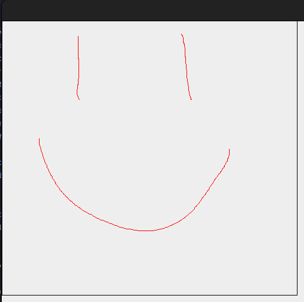

This concludes my first prototype as I believe this is a good starting point, but some systems already need to be improved upon.

## Prototype 2
Beginning this prototype, the GUI initialisation code is fine for now, and so is the idea of the canvas.
However, significant changes will be made to the input handling through this prototype.
Object-orientated programming is perfect for a program like this.

### Element Class
Instead of the Canvas class being its own stand-alone class, it should extend a parent Element class.
The element class will hold all GUI elements which need to be drawn and clicked.
With this in mind, the element class is shown below:
```java
public abstract class Element {
    // static list of elements, to be used for handling each element
    public static ArrayList<Element> elements = new ArrayList<>();

    public int x, y, width, height;

    /// lower priority means it is drawn first and handled last
    public int priority;

    public Element(int x, int y, int width, int height, int priority) {
        this.x = x;
        this.y = y;
        this.width = width;
        this.height = height;
        this.priority = priority;

        // when the element is initialised, it is added to the list for other parts of the program to handle it.
        elements.add(this);
        elements.sort(Comparator.comparingInt(a -> a.priority));
    }

    public abstract void draw(Graphics2D g);

    /// return true if it wishes to block the click from registering to others
    public abstract boolean handleClick(MouseEvent g);
    public abstract boolean handleDrag(MouseEvent g);
    public abstract boolean handleHover(MouseEvent g);
}
```
I later decided to remove the priority variable.
This is because I believe it is more readable to have a handwritten list of each element in order, as opposed to allowing each to define its own priority.
Canvas is changed to extend Element.
The draw function was already implemented, so I just need to implement the handleClick, handleDrag and handleHover functions.
The handleDrag function for the canvas is currently handled by the MouseMotionListener, so I moved its code to the Canvas class.
This makes the Canvas class change to below:
```java
public class Canvas extends Element {
    private static final int DEFAULT_CANVAS_WIDTH = 500, DEFAULT_CANVAS_HEIGHT = 500;

    public static BufferedImage CANVAS_IMAGE = new BufferedImage(DEFAULT_CANVAS_WIDTH, DEFAULT_CANVAS_HEIGHT, BufferedImage.TYPE_INT_ARGB);
    public static Graphics2D IMAGE_GRAPHICS = (Graphics2D) CANVAS_IMAGE.getGraphics();

    public Canvas() {
        // priority 0 means it is drawn first
        super(0, 0, DEFAULT_CANVAS_WIDTH, DEFAULT_CANVAS_HEIGHT, 0);
    }

    @Override
    public void draw(Graphics2D g) {
        g.scale((double) this.width / CANVAS_IMAGE.getWidth(), (double) this.height / CANVAS_IMAGE.getHeight());

        g.drawRect(0, 0, CANVAS_IMAGE.getWidth(), CANVAS_IMAGE.getHeight());
        g.drawImage(CANVAS_IMAGE, 0, 0, null);
    }

    @Override
    public boolean handleClick(MouseEvent e) {
        Canvas.CANVAS_IMAGE.setRGB(e.getX(), e.getY(), Color.RED.getRGB());

        return true;
    }

    @Override
    public boolean handleDrag(MouseEvent e) {
        if (MouseMotionListener.lastMouseDragX == -1) return false;

        Canvas.IMAGE_GRAPHICS.setColor(Color.RED);
        Canvas.IMAGE_GRAPHICS.drawLine(MouseMotionListener.lastMouseDragX, MouseMotionListener.lastMouseDragY, e.getX(), e.getY());

        return true;
    }

    @Override
    public boolean handleHover(MouseEvent e) {
        return false;
    }

}
```
Since lastMouseDragX and lastMouseDragY from MouseMotionListener are both now needed in Canvas, it doesn't make sense to encapsulate them any more.
lastMouseDragX and lastMouseDragY are made public, which changes MouseListener's mouseReleased function to:
```java
public void mouseReleased(MouseEvent e) {
    MouseMotionListener.lastMouseDragX = MouseMotionListener.lastMouseDragY = -1;
}
```
With these changes, we now need to call each Element function in their correct places.
The draw function is called within Main.java's drawLoop function, shown below:
```java
private static void drawLoop() {
    // ...
    // draw each element
    Canvas.elements.forEach(element -> {
        AffineTransform currentTransform = FRAME_GRAPHICS.getTransform();
        FRAME_GRAPHICS.translate(element.x, element.y);

        element.draw(FRAME_GRAPHICS);

        FRAME_GRAPHICS.setTransform(currentTransform);
    });
    // ...
}
```
And the handleDrag is handled by MouseMotionListener, as shown below:
```java
@Override
public void mouseDragged(MouseEvent e) {
    for (Element element : Element.elements.reversed()) {
        // breaks out of the loop if the element wants to stop other elements from handling the drag event
        if (element.handleDrag(e)) break;
    }

    lastMouseDragX = e.getX();
    lastMouseDragY = e.getY();
}
```
The other listeners were not previously implemented, so I will need to create new listeners for them.
The handleHovered event is handled in the MouseMotionListener as shown below:
```java
@Override
public void mouseDragged(MouseEvent e) {
    // ...
    handleMouseMoveEvent(e);
    // ...
}

@Override
public void mouseMoved(MouseEvent e) {
    handleMouseMoveEvent(e);
}

private boolean isElementHovered(MouseEvent e, Element element) {
    return e.getX() >= element.x && e.getX() <= element.x + element.width && e.getY() >= element.y && e.getY() <= element.y + element.height;
}

private void handleMouseMoveEvent(MouseEvent e) {
    // reset the cursor to the default cursor, the element can then handle if it wants to change the cursor to something else
    Main.FRAME.setCursor(Cursor.getDefaultCursor());
    
    for (Element element : Element.elements.reversed()) {
        // breaks out of the loop if the element wants to stop other elements from handling the hover event
        if (isElementHovered(e, element) && element.handleHover(e)) break;
    }
}
```
While writing the mouseClicked event, I realised that it makes sense to set the dragging element in there.
I changed the handleDrag event to be posted as so:
```java
@Override
public void mouseDragged(MouseEvent e) {
    if (CURRENTLY_DRAGGING_ELEMENT != null) {
        CURRENTLY_DRAGGING_ELEMENT.handleDrag(e);
        CURRENTLY_DRAGGING_ELEMENT.handleHover(e);
    }

    lastMouseDragX = e.getX();
    lastMouseDragY = e.getY();
}
```
Where CURRENTLY_DRAGGING_ELEMENT is set inside MouseListener's mousePressed function, shown below:
```java
@Override
public void mousePressed(MouseEvent e) {
    boolean setDraggingElement = false;
    for (Element element : Main.ELEMENTS.reversed()) {
        // breaks out of the loop if the element currently hovered wants to stop other elements from handling the click event
        if (MouseUtil.isMouseHovering(e, element)) {
            if (!setDraggingElement) {
                MouseMotionListener.CURRENTLY_DRAGGING_ELEMENT = element;
                setDraggingElement = true;
            }
            if (element.handleClick(e)) break;
        }
    }
}
```
With all these changes made to the Canvas class, the functionality of the program should be the same, with the code now much more robust.
However, when implementing the handleClick function, I found a bug; when clicking on the furtherest right pixel of the canvas, an error was printed to the console.

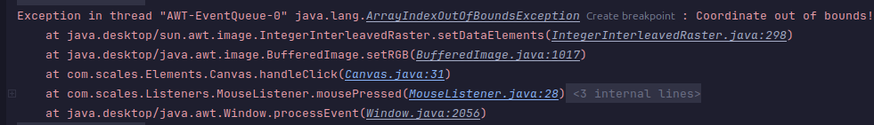

By following the stack trace, I found the origin of the error.
```java
public boolean handleClick(MouseEvent e) {
    Canvas.CANVAS_IMAGE.setRGB(e.getX(), e.getY(), Color.RED.getRGB()); // <------- this line
    // ...
}
```
This causes an error because the mouse X can be outside the bounds of the canvas picture.
It can be out of bounds as the mouse X is compared to the width of the element, which is 1 larger than the images' width.
This can be fixed by changing the isHovered to not allow "<=", but instead "<".
However, I prefer to fix it by checking if the coordinate is in bounds as so because it is more robust and easier to understand.
The fixed handleClick function is now shown below:
```java
@Override
public boolean handleClick(MouseEvent e) {
    if (e.getX() >= 0 && e.getX() < CANVAS_IMAGE.getWidth() && e.getY() >= 0 && e.getY() < CANVAS_IMAGE.getHeight()) {
        Canvas.CANVAS_IMAGE.setRGB(e.getX(), e.getY(), Color.RED.getRGB());
    }
    // ...
}
```

### Resizing the canvas
To test the new Element class, I decided to make the Canvas resizable.
With the Element clas it was made incredibly simple to change the mouse cursor and change the size of the canvas.
From what could have been 100+ lines of code, to what is shown below:
```java
public class ResizeCanvasButton extends Element {
    public ResizeCanvasButton() {
        super(495, 495, 10, 10);
    }

    @Override
    public void draw(Graphics2D g) {
        updatePosition();

        g.setColor(Color.BLACK);
        g.fillRect(0, 0, width, height);
    }

    @Override
    public boolean handleClick(MouseEvent e) {
        return false;
    }

    @Override
    public boolean handleDrag(MouseEvent e) {
        Main.CANVAS.resizeCanvas(e.getX(), e.getY());
        updatePosition();
        return true;
    }

    @Override
    public boolean handleHover(MouseEvent e) {
        Main.FRAME.setCursor(Cursor.getPredefinedCursor(Cursor.NW_RESIZE_CURSOR));
        return true;
    }

    private void updatePosition() {
        this.x = Canvas.CANVAS_IMAGE.getWidth() - (this.width / 2);
        this.y = Canvas.CANVAS_IMAGE.getHeight() - (this.height  / 2);
    }
}
```
Canvas.resizeCanvas was created too which is shown below:
```java
public void resizeCanvas(int width, int height) {
    // store the old image so it can be redrawn to the new resized image.
    BufferedImage oldImage = CANVAS_IMAGE;
    IMAGE_GRAPHICS.dispose();

    CANVAS_IMAGE = new BufferedImage(width, height, BufferedImage.TYPE_INT_ARGB);
    IMAGE_GRAPHICS = (Graphics2D) CANVAS_IMAGE.getGraphics();
    IMAGE_GRAPHICS.drawImage(oldImage, 0, 0, null);
    this.width = width;
    this.height = height;
}
```
Below is a screenshot of me hovering the resize button.

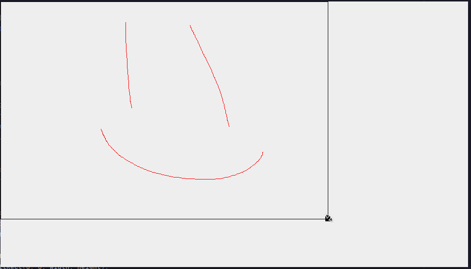

However, this does cause an uncaught exception.
Shown below is the stack trace:

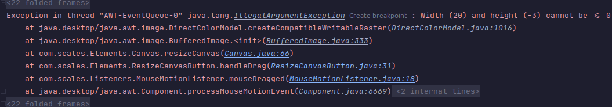

When the resize button is dragged above or to the left of the edge of the screen, the resize value passed becomes negative.
This is simply fixed by only resizing the canvas if the new width and height are both more than 0, as described by the error message.
This fix was implemented as below, it sets width to the highest amount out of width and 1, and idem for height:
```java
public void resizeCanvas(int width, int height) {
    width = Math.max(width, 1);
    height = Math.max(height, 1);
    // ...
}
```

### Fixing Transformations
When transformations such as translation are applied to an Element, it causes the position interacted from to be wrong.
For fixing the interacted position, I created a new function shown below which is called when handling mouse clicks
```java
public int applyTransform(int n, int offset) {
    return (int) (n / this.scale) - offset;
}
```
So Canvas' handleDrag function changes to:
```java
public boolean handleDrag(MouseEvent e) {
    // ...
    Canvas.IMAGE_GRAPHICS.drawLine(
            this.applyTransform(MouseMotionListener.lastMouseDragX),
            this.applyTransform(MouseMotionListener.lastMouseDragY),
            this.applyTransform(e.getX()),
            this.applyTransform(e.getY())
    );
    // ...
}
```
And for the resize canvas button, I need to apply these transformations when resizing the canvas:
```java
public void resizeCanvas(int width, int height) {
    // ...
    int newWidth = Math.max(this.applyTransform(width, this.x), 1);
    int newHeight = Math.max(this.applyTransform(height, this.y), 1);
    CANVAS_IMAGE = new BufferedImage(newWidth, newHeight, BufferedImage.TYPE_INT_ARGB);
    // ...
    this.width = newWidth;
    this.height = newHeight;
}
```
as well as undo them when updating the position of the resize button:
```java
private void updatePosition() {
    this.x = Main.CANVAS.undoTransform(Main.CANVAS.width, Main.CANVAS.x);
    this.y = Main.CANVAS.undoTransform(Main.CANVAS.height, Main.CANVAS.y);
}
```
Which requires a new undoTransform function in Element:
```java
public int undoTransform(int n, int offset) {
    return (int) (n * this.scale) + offset;
}
```
These functions also fix the newly added "scale" variable, which I plan to use to add zooming in/out to the canvas.

### Applying Transformations
Currently, the canvas cannot be translated, scaled or rotated, which are the three cardinal transformations.
To modify translation upon the y-axis, I will need an event which is posted when the mouse wheel is scrolled.
In Main.java the initialiseGUI function is updated to register this new listener:
```java
private static void initialiseGUI() {
    // ...
    FRAME.addMouseWheelListener(new MouseWheelListener());
}
```
And then I need to make a MouseWheelListener class as so:
```java
public class MouseWheelListener implements java.awt.event.MouseWheelListener {
    private static final int SCALE_INCREMENT = 10;

    @Override
    public void mouseWheelMoved(MouseWheelEvent e) {
        // scrolls the canvas when the mouse wheel is scrolled
        Main.CANVAS.y += e.getUnitsToScroll() * SCALE_INCREMENT;
    }
}
```
This allows me to scroll my canvas up and down, which is a nice feature.
Generally, holding SHIFT while scrolling makes it scroll on the x-axis, so for that we need to monitor key presses.
```java
private static void initialiseGUI() {
    // ...
    FRAME.addKeyListener(new KeyListener());
}
```
And then we need this class to allow other classes to know which keys are currently pressed.
This can be done using a HashMap as it has a constant time complexity for adding, removing and getting an element.
This isn't necessarily faster, as the number of keys pressed is usually a single digit and the computation time of adding to a hashmap is longer than a simple array.
However, the syntax of HashMap is more readable, as well as it ensuring no duplicate keys are added.
```java
public class KeyListener extends KeyAdapter {
    private static final HashMap<Integer, Boolean> KEYS_PRESSED = new HashMap<>();
    public static boolean isKeyDown(int keyCode) {
        return KEYS_PRESSED.containsKey(keyCode);
    }
    
    @Override
    public void keyPressed(KeyEvent e) {
        KEYS_PRESSED.put(e.getKeyCode(), true);
    }
    @Override
    public void keyReleased(KeyEvent e) {
        KEYS_PRESSED.remove(e.getKeyCode());
    }
}
```
This allows us to check if SHIFT is currently pressed and increment the x-axis if it is.
```java
public void mouseWheelMoved(MouseWheelEvent e) {
    // scrolling just by "getUnitsToScroll" is very slow, so we multiply it by a constant
    int scrollAmount = e.getUnitsToScroll() * SCALE_INCREMENT;
    
    if (KeyListener.isKeyDown(KeyEvent.VK_SHIFT)) Main.CANVAS.x += scrollAmount;
    else Main.CANVAS.y += scrollAmount;
}
```
Which allows us to position the canvas where-ever we want it.

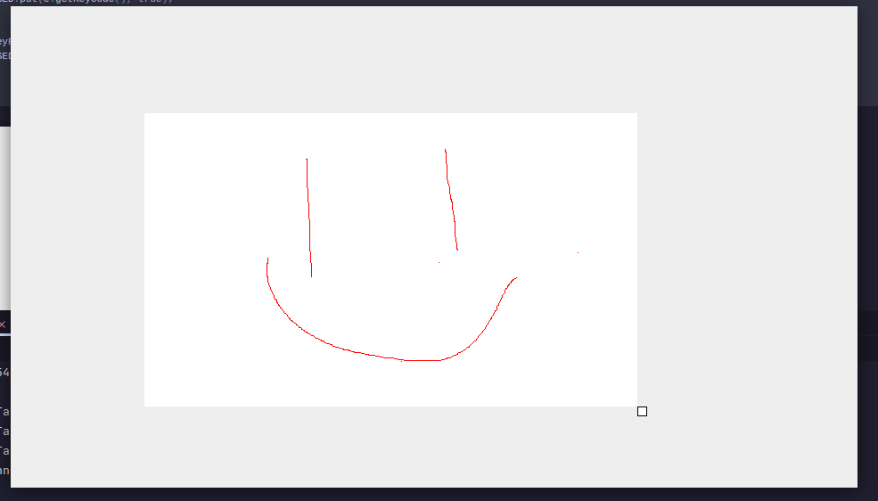

Adding scaling now is comically easy, if CTRL is held while scrolling, it should scale instead of scrolling.
```java
public void mouseWheelMoved(MouseWheelEvent e) {
    if (KeyListener.isKeyDown(KeyEvent.VK_CONTROL)) {
        Main.CANVAS.scale -= e.getUnitsToScroll() / 10f;
        // makes sure the scale isn't too small/big
        Main.CANVAS.scale = Math.clamp(Main.CANVAS.scale, 0.1f, 30);
    }
    // ...
}
```
This allows us to zoom in and see each pixel as shown below:

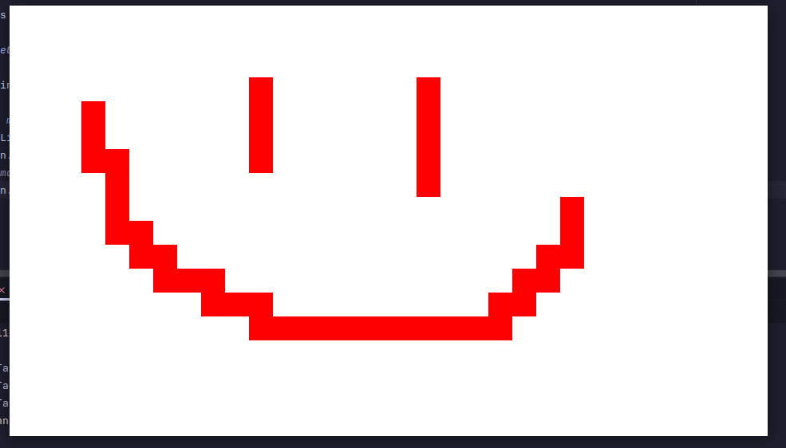

However, this zooming is not very user-friendly.
The first glaring issue was easily fixable, it was too slow.
The second issue was that it always zoomed in centered on the top left of the canvas.
This was not so easily fixed, however, I believe my solution is intuitive.
When zooming in, the pixel your mouse is hovering, is the same as before zooming in.
This is calculated by offsetting the canvas x and y by the formula shown below:

`pos = mousePos - ((mousePos - pos) * scaleDifference)`

The finished scrolling ended up as:
```java
public void mouseWheelMoved(MouseWheelEvent e) {
    // ...
    // store old scale
    double oldScale = Main.CANVAS.scale;

    Main.CANVAS.scale -= e.getUnitsToScroll() / 5f;
    Main.CANVAS.scale = Math.clamp(Main.CANVAS.scale, 0.1f, 30);

    double scaleFactor = Main.CANVAS.scale / oldScale;
    // make sure that the pixel the mouse is over is the same after zooming in
    Main.CANVAS.x = (int) (e.getX() - ((e.getX() - Main.CANVAS.x) * scaleFactor));
    Main.CANVAS.y = (int) (e.getY() - ((e.getY() - Main.CANVAS.y) * scaleFactor));
    // ...
}
```
Which results in much smoother zooming in.
Below are pictures from before and after zooming in, without moving the mouse:

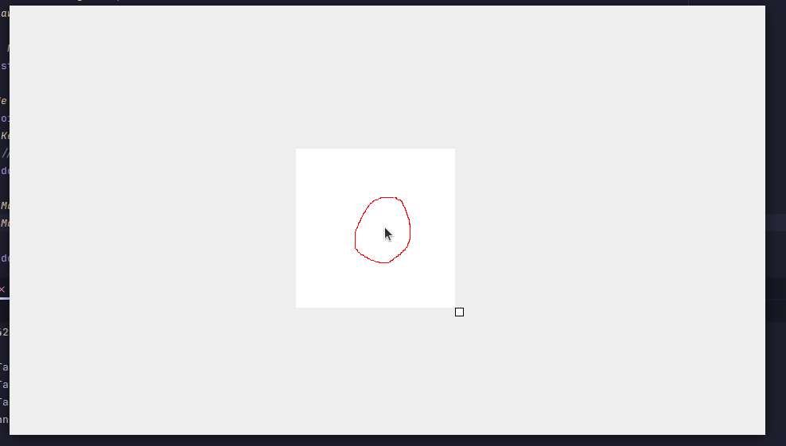
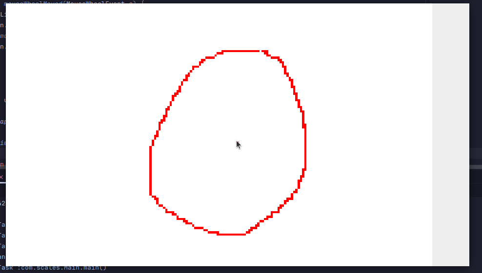

As a final fix of this prototype, when clicking, the "lastMouseDragX" and "lastMouseDragY" variables are still at -1.
If the mouse is moving while clicked, this causes there to be a dot where first clicked, and a gap because it takes 1 frame to start interpolating.
The error is shown below:


This is easily fixed by setting the "lastMouseDragX" and "lastMouseDragY" on mouse click, and removing setting them to -1 on release.
```java
public void mouseReleased(MouseEvent e) {
    MouseMotionListener.CURRENTLY_DRAGGING_ELEMENT = null;
    // removed resetting lastMouseDragX and lastMouseDragY to -1
}

public void mousePressed(MouseEvent e) {
    // ...
    MouseMotionListener.lastMouseDragX = e.getX();
    MouseMotionListener.lastMouseDragY = e.getY();
    MouseMotionListener.CURRENTLY_DRAGGING_ELEMENT = element;
    // ...
}
```
This concludes prototype 2; I believe it is possible to easily shape this prototype into a fully functional program.
The Element class allows me to easily add new elements to the GUI, which should make it easy to add new features.
The listener classes implemented provide useful utilities for developing future features.
And using the JavaFX graphics library allows me to easily add complex features such as antialiasing and drawing circles.


## Prototype 3
### Toolbar
Having a toolbar which holds all the other cursor options is a good idea.
I want the toolbar to constantly be the same width as the frame.
For this I need a listener for when the frame is resized:
```java
public class ComponentListener extends ComponentAdapter {
    @Override
    public void componentResized(ComponentEvent e) {
        Main.TOOLBAR.width = e.getComponent().getWidth();
    }
}
```
And of course, a Toolbar class:
```java
public class Toolbar extends Element {
    public Toolbar() {
        super(0, 0, Main.DEFAULT_FRAME_SIZE.width, 50);
    }

    @Override
    public void draw(Graphics2D g) {
        g.setColor(Color.BLACK);
        g.fillRect(0, 0, width, height);
    }
    // ...
}
```
Next, I decided changing the cursor while hovering the canvas was a nice touch, which was simply done by:
```java
public boolean handleHover(MouseEvent e) {
    Main.FRAME.setCursor(Cursor.getPredefinedCursor(Cursor.CROSSHAIR_CURSOR));
    // ...
}
```
However, this allowed me to find a bug, due to me resetting the cursor constantly, it flickers to the wrong cursor sometimes, while still hovering an element.
This was easily fixed by only resetting the cursor if no element is hovered.
```java
private void handleMouseMoveEvent(MouseEvent e) {
    for (Element element : Main.ELEMENTS.reversed()) {
        // returns if we are hovering an element to stop the cursor being reset
        if (MouseUtil.isMouseHovering(e, element) && element.handleHover(e)) return;
    }
    
    // reset the cursor to the default cursor because no element is hovered
    Main.FRAME.setCursor(Cursor.getDefaultCursor());
}
```
Making the canvas start centered on the screen was another nice touch.
```java
public Canvas() {
    // x, y, width, height
    super(
            Main.DEFAULT_FRAME_SIZE.width / 2 - DEFAULT_CANVAS_WIDTH / 2,
            Main.DEFAULT_FRAME_SIZE.height / 2 - DEFAULT_CANVAS_HEIGHT / 2,
            DEFAULT_CANVAS_WIDTH,
            DEFAULT_CANVAS_HEIGHT
    );
}
```
The program now looks like this, with the toolbar being a placeholder:

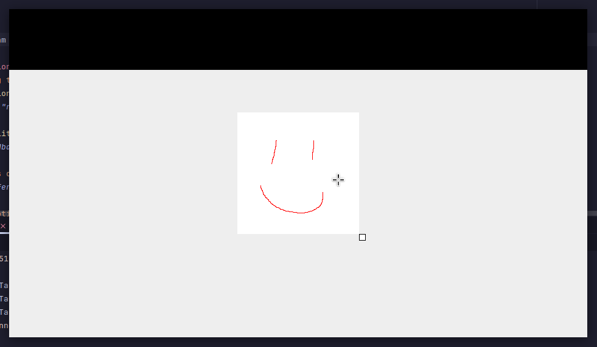

The first thing I want to add to the toolbar is buttons for the different cursor options.
For this I will create an abstract Cursor class which subclasses can then extend to fill in the functions.
```java
public abstract class Cursor {
    public final BufferedImage ICON;

    public Cursor(BufferedImage ICON) {
        this.ICON = ICON;
    }
    
    public final Canvas PARENT = Main.CANVAS;
    public BufferedImage getParentImage() {
        return Canvas.CANVAS_IMAGE;
    }
    public Graphics2D getParentGraphics() {
        return Canvas.IMAGE_GRAPHICS;
    }

    public abstract void handleClick(MouseEvent e);
    public abstract void handleDrag(MouseEvent e);
    public abstract void handleRelease(MouseEvent e);
}
```
The first Cursor I implemented is the Pencil cursor, which is what I have been testing with:
```java
public class Pencil extends Cursor {
    public Pencil() {
        // todo: make icon
        super(new BufferedImage(10, 10, BufferedImage.TYPE_INT_ARGB));
    }

    @Override
    public void handleClick(MouseEvent e) {
        int x = PARENT.applyTransform(e.getX(), PARENT.x);
        int y = PARENT.applyTransform(e.getY(), PARENT.y);
        if (x >= 0 && x < getParentImage().getWidth() && y >= 0 && y < getParentImage().getHeight()) {
            getParentImage().setRGB(x, y, Color.RED.getRGB());
        }
    }

    @Override
    public void handleDrag(MouseEvent e) {
        Canvas.IMAGE_GRAPHICS.setColor(Color.RED);
        Canvas.IMAGE_GRAPHICS.drawLine(
                PARENT.applyTransform(MouseMotionListener.lastMouseDragX, PARENT.x),
                PARENT.applyTransform(MouseMotionListener.lastMouseDragY, PARENT.y),
                PARENT.applyTransform(e.getX(), PARENT.x),
                PARENT.applyTransform(e.getY(), PARENT.y)
        );
    }

    @Override
    public void handleRelease(MouseEvent e) {

    }
}
```
And I added a paint brush cursor, which is the same, but with antialiasing:
```java
public class PaintBrush extends Cursor {
    public PaintBrush() {
        // todo: make icon
        super(new BufferedImage(10, 10, BufferedImage.TYPE_INT_ARGB));
    }

    @Override
    public void handleClick(MouseEvent e) {
        Main.PENCIL.handleClick(e);
    }

    @Override
    public void handleDrag(MouseEvent e) {
        getParentGraphics().setRenderingHint(RenderingHints.KEY_ANTIALIASING, RenderingHints.VALUE_ANTIALIAS_ON);
        Main.PENCIL.handleDrag(e);
        getParentGraphics().setRenderingHint(RenderingHints.KEY_ANTIALIASING, RenderingHints.VALUE_ANTIALIAS_OFF);
    }

    @Override
    public void handleRelease(MouseEvent e) {

    }
}
```
I added two cursors as I needed at least two to test if my toolbar allows me to switch between them.
In the main file I need to create an array of the Cursor subclasses so that the toolbar can access them.
I also need to store the current cursor, this allows the toolbar to render which cursor is currently selected.
The currentCursor variable is also needed for the Canvas class to call the correct handleDraw/handleDrag/handleRelease functions.
Below is how I initialise the array of cursors:
```java
public static final Pencil PENCIL = new Pencil();
public static final PaintBrush PAINT_BRUSH = new PaintBrush();
public static Cursor currentCursor = PAINT_BRUSH;

public static final List<Cursor> CURSORS = List.of(
        PENCIL,
        PAINT_BRUSH
);
```
In my toolbar class, I need to draw an icon for each cursor and also indicate which cursor is currently selected.
This is simple enough to do; we first need to loop through the array of cursors.
Using the index of the cursor, we can offset its x coordinate so that none overlap.
For this I created a function "getIconX":
```java
private int getIconX(int i) {
    return (ICON_SPACING+ICON_SIZE) * i + ICON_SPACING;
}
```
For easier modification of code I created two constants and a supporting function which are used throughout the class to determine icon positions:
```java
private static final int ICON_SIZE = 50;
private static final int ICON_SPACING = 10;

private int getIconY() {
    return (this.height - ICON_SIZE) / 2;
}
```
The draw function is then simply done:
```java
public void draw(Graphics2D g) {
    // ...
    for (int i = 0; i < Main.CURSORS.size(); i++) {
        Cursor cursor = Main.CURSORS.get(i);
        // if the cursor box being drawn right now is the current cursor, its drawn darker.
        g.setColor(Main.currentCursor == cursor ? Color.WHITE.darker() : Color.WHITE);
        g.fillRect(getIconX(i), getIconY(), ICON_SIZE, ICON_SIZE);
        g.drawImage(cursor.ICON, getIconX(i), getIconY(), ICON_SIZE, ICON_SIZE, null);
    }
}
```
Since the icons of each cursor are currently blank, the interface looks like this:

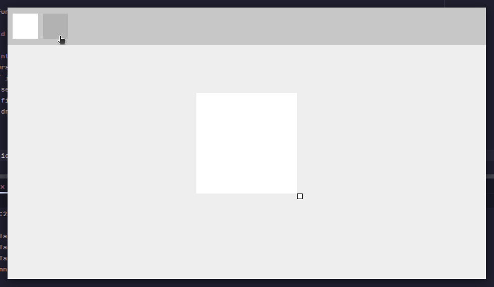

The current hovered cursor is determined with a simple loop:
```java
private Cursor getHoveredCursor(MouseEvent e) {
    for (int i = 0; i < Main.CURSORS.size(); i++) {
        if (MouseUtil.isMouseHovering(e, getIconX(i), getIconY(), ICON_SIZE, ICON_SIZE)) {
            return Main.CURSORS.get(i);
        }
    }
    
    return null;
}
```

### Refactoring Positions
Between features, I thought it makes more sense for each Element's transformations to be a lambda function.
Previously we gave the constructor x,y,width,height and had to worry about updating these values when needed.
Now, we simply pass a function as each parameter, and each time they are called, their position is checked again.
Here are the changes to the element class:
```java
@RequiredArgsConstructor
public abstract class Element {
    @NonNull public IntSupplier x, y, width, height;
    // ...
}
```
Then new classes extending it create constructors such as:
```java
public Toolbar() {
    super(
            () -> 0,
            () -> 0,
            () -> Main.FRAME.getWidth(), // this variable would normally need to be updated somehow, instead it is updated when called.
            () -> 75
    );
}
```
This saves time, makes the code more readable and runs faster.
It is easier to follow the code when the rectangle can only be updated in one place.
The code can run faster as each Element's rectangle is never updated unnecessarily.

### Changing Colours
Drawing with only red is not very interesting or helpful.
For my program to have any use at all, I need to be able to change the colour of the cursor.
This is not so easily done.
First, I need to create a variable in Cursor which determines the colour each cursor will draw with:
```java
public static Color CURSOR_COLOR = Color.RED;
```
Next we need to create a colour picker element.
I decided to split the colour picker into five separate elements.
The first element is the button which opens and closes the colour picker.
This element was simple to make:
```java
public class ColourPickerButton extends Element {
    public boolean open = false;

    public ColourPickerButton() {
        super(
                () -> Main.FRAME.getWidth() - Toolbar.ICON_SIZE - Toolbar.ICON_SPACING,
                () -> Main.TOOLBAR.getIconY(),
                () -> Toolbar.ICON_SIZE,
                () -> Toolbar.ICON_SIZE
        );
    }

    @Override
    public void draw(Graphics2D g) {
        // draws the current colour
        g.setColor(com.scales.Cursors.Cursor.CURSOR_COLOR);
        g.fillRect(0, 0, width.getAsInt(), height.getAsInt());
    }

    @Override
    public boolean handleClick(MouseEvent e) {
        // open / close colour picking
        Main.COLOUR_PICKER_BUTTON.open = !Main.COLOUR_PICKER_BUTTON.open;
        return true;
    }

    @Override
    public boolean handleDrag(MouseEvent e) {
        return true;
    }

    @Override
    public boolean handleHover(MouseEvent e) {
        Main.FRAME.setCursor(Cursor.getPredefinedCursor(Cursor.HAND_CURSOR));
        return true;
    }
}
```
The background of the colour picker expanded box was also simple to make:
```java
public class ColourPickerBackground extends Element {
    public static final int BACKGROUND_Y = Main.TOOLBAR.getIconY() + Toolbar.ICON_SIZE;

    public ColourPickerBackground() {
        super(
                () -> Main.COLOUR_PICKER_BUTTON.x.getAsInt() - BOX_DIAMETER,
                () -> BACKGROUND_Y,
                () -> BOX_DIAMETER,
                () -> BOX_DIAMETER
        );
    }

    @Override
    public void draw(Graphics2D g) {
        if (!Main.COLOUR_PICKER_BUTTON.open) return;

        g.setColor(new Color(22,22,22));
        g.fillRect(0, 0, width.getAsInt(), height.getAsInt());
    }

    @Override
    public boolean handleClick(MouseEvent e) {
        return true;
    }

    @Override
    public boolean handleDrag(MouseEvent e) {
        return Main.COLOUR_PICKER_BUTTON.open;
    }

    @Override
    public boolean handleHover(MouseEvent e) {
        if (!Main.COLOUR_PICKER_BUTTON.open) return false;

        Main.FRAME.setCursor(Cursor.getPredefinedCursor(Cursor.DEFAULT_CURSOR));
        return true;
    }
}
```
It also contains constants used throughout the other colour picker elements:
```java
private static final int BOX_DIAMETER = 220;
private static final int BAR_SIZE = 15;
private static final int BAR_SPACING = 5;
private static final int SATURATION_BRIGHTNESS_BOX_SIZE = BOX_DIAMETER-BAR_SIZE-BAR_SPACING*3;

private static final float[] HSL = Color.RGBtoHSB(getCurrentColour().getRGB(), getCurrentColour().getGreen(), getCurrentColour().getBlue(), new float[4]);
private static float OPACITY = getCurrentColour().getAlpha() / 255f;

private static Color getCurrentColour() {
    return Cursor.CURSOR_COLOR;
}

private static final int BACKGROUND_Y = Main.TOOLBAR.getIconY() + Toolbar.ICON_SIZE;

public static void setColour() {
    // set the colour to our new edited HSB colours
    Color newHsbColour = Color.getHSBColor(HSL[0], 1-HSL[1], 1-HSL[2]);
    // set opacity
    Cursor.CURSOR_COLOR = new Color(newHsbColour.getRed(), newHsbColour.getGreen(), newHsbColour.getBlue(), (int) (OPACITY*255));
}
```
The hard part is drawing gradient bars to represent the individual parts of the colour picker.
To draw a gradient, I loop through each pixel in the gradient, set the colour to its appropriate colour, and draw the pixel.
The box which shows all the saturation and brightness values was the most complex as it had to fade two ways.
Here is my implementation:
```java
public void draw(Graphics2D g) {
    // ...
    // loops a full square
    for (int x = 0; x < SATURATION_BRIGHTNESS_BOX_SIZE; x++) {
        for (int y = 0; y < SATURATION_BRIGHTNESS_BOX_SIZE; y++) {
            // gets a ratio of x/width, this value is the ratio of the current progress through the gradient
            float saturation = (float) x / SATURATION_BRIGHTNESS_BOX_SIZE;
            float brightness = (float) y / SATURATION_BRIGHTNESS_BOX_SIZE;
            
            g.setColor(Color.getHSBColor(HSL[0], 1-saturation, 1-brightness));
            // draw the pixel
            g.fillRect(x, y, 1, 1);
        }
    }
    // ...
}
```
Then, to get the colour the mouse of hovering over, we reverse the gradient math:
```java
public boolean handleDrag(MouseEvent e) {
    // ...
    HSB[1] = Math.clamp((float) mouseX / SATURATION_BRIGHTNESS_BOX_SIZE, 0, 1);
    HSB[2] = Math.clamp((float) mouseY / SATURATION_BRIGHTNESS_BOX_SIZE, 0, 1);
    // ...
}

```
The HueSlider and OpacitySlider Elements follow the same concept.
Together these elements make the colour picker:

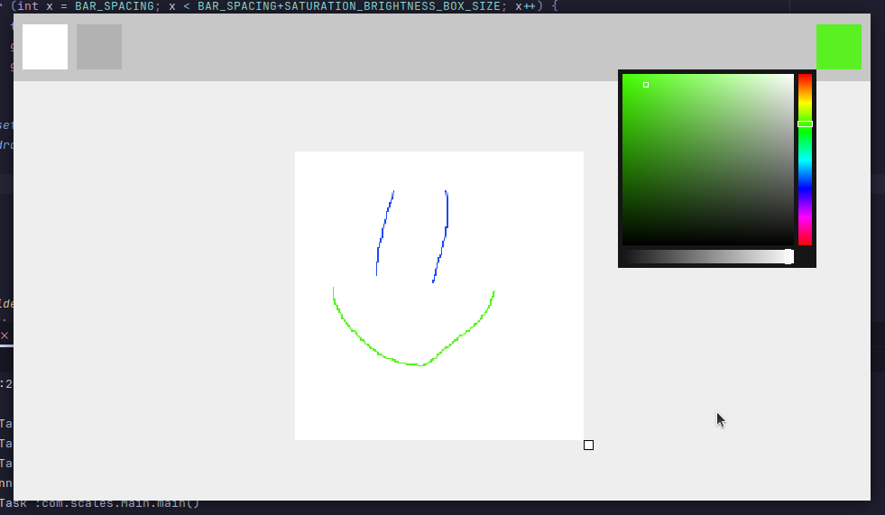

This concludes prototype 3.
In this prototype a base for changing the action the cursor performs was created.
This allows for easy expansion of the program to include other more complex cursor options.
The colour picker was a necessary feature which I am glad to have implemented early.

## Prototype 4
### Undo/Redoing
I decided to implement undo/redoing as a feature of the program.
To handle this, we need to create a stack of all the actions the user has performed.
I store this stack in its own class, HandleUndoTimeline.
For this project I decided to store these stacks as this:
```java
public static final ArrayList<BufferedImage> CHANGES_BUFFER = new ArrayList<>();
public static final ArrayList<BufferedImage> REDO_BUFFER = new ArrayList<>();
```
The CHANGES_BUFFER is updated before a mouse click is executed in Canvas.java:
```java
public boolean handleClick(MouseEvent e) {
    HandleUndoTimeline.bufferCanvas();
    // ...
}
```
This calls the new bufferCanvas function. This function creates a copy of the image and appends it to the CHANGES_BUFFER.
It also resets the REDO_BUFFER as the new drawing is now the latest.
We only want to buffer up to 10 images to save RAM, so we remove the earliest item from the stack if it is full.
Here is the bufferCanvas code which is called when drawing:
```java
public static void bufferCanvas() {
    REDO_BUFFER.clear();
    
    BufferedImage imageClone = new BufferedImage(Canvas.CANVAS_IMAGE.getWidth(), Canvas.CANVAS_IMAGE.getHeight(), Canvas.CANVAS_IMAGE.getType());
    imageClone.getGraphics().drawImage(Canvas.CANVAS_IMAGE, 0, 0, null);
    CHANGES_BUFFER.add(imageClone);
    imageClone.getGraphics().dispose();
    
    if (CHANGES_BUFFER.size() > 10) CHANGES_BUFFER.removeFirst();
}
```
In the KeyListener class, we need to handle key presses for CTRL+Z and CTRL+Y:
```java
public void keyPressed(KeyEvent e) {
    // ...
    if (isKeyDown(KeyEvent.VK_CONTROL)) {
        HandleUndoTimeline.handleCtrlKey(e);
    }
}
```
Which is handled in HandleUndoTimeline:
```java
public static void handleCtrlKey(KeyEvent e) {
    if (e.getKeyCode() == KeyEvent.VK_Z && !CHANGES_BUFFER.isEmpty()) {
        REDO_BUFFER.add(Canvas.CANVAS_IMAGE);
        loadCanvas(CHANGES_BUFFER.removeLast());
    }
    else if (e.getKeyCode() == KeyEvent.VK_Y && !REDO_BUFFER.isEmpty()) {
        CHANGES_BUFFER.add(Canvas.CANVAS_IMAGE);
        loadCanvas(REDO_BUFFER.removeLast());
    }
}
```
The loadCanvas function sets the image and graphics to the BufferedImage item popped from the stack:
```java
public static void loadCanvas(BufferedImage image) {
    Canvas.CANVAS_IMAGE = image;
    Canvas.IMAGE_GRAPHICS = (Graphics2D) Canvas.CANVAS_IMAGE.getGraphics();
}
```
### Rubber
Implementing a rubber seems easy at first.
The pencil class already handles drawing lines, in theory we can just draw a line with no opacity and call it a rubber.
However, by default the graphics library interpolates between the colour drawn atop and beneath by their alpha.
This means that a max opacity line takes full priority, whereas a no opacity line is not drawn at all.
The graphics library does supply a way to change this behaviour.
The graphics library has a "setComposite" method which allows us to change the alpha blending mode.
We can change the code to overwrite the colour below it with the new colour, then reset the composite.
Here is how we implement this:
```java
public void handleDrag(MouseEvent e) {
    Composite composite = Canvas.IMAGE_GRAPHICS.getComposite();
    Canvas.IMAGE_GRAPHICS.setComposite(AlphaComposite.Clear);
    Canvas.IMAGE_GRAPHICS.setColor(new Color(0, 0, 0, 0));
    Main.PENCIL.drawLine(e, 5);
    Canvas.IMAGE_GRAPHICS.setComposite(composite);
}
```
While I was experimenting with the new graphics functions, I discovered I came across a function which changes the stroke width.
I decided to make a general drawLine function which takes mouse coordinates and stroke width as parameters:
```java
public void drawLine(MouseEvent e, int width) {
    // fix coordinates to be local to the canvas.
    int x1 = PARENT.applyTransform(MouseMotionListener.lastMouseDragX, PARENT.x.getAsInt());
    int y1 = PARENT.applyTransform(MouseMotionListener.lastMouseDragY, PARENT.y.getAsInt());
    int x2 = PARENT.applyTransform(e.getX(), PARENT.x.getAsInt());
    int y2 = PARENT.applyTransform(e.getY(), PARENT.y.getAsInt());
    
    int xChange = x2 - x1;
    int yChange = y2 - y1;
    // no point rendering a 0-width line
    if (xChange == 0 && yChange == 0) return;
    
    // store previous stroke to be restored
    Stroke stroke = Canvas.IMAGE_GRAPHICS.getStroke();
    // set stroke width to the parameter passed
    Canvas.IMAGE_GRAPHICS.setStroke(new BasicStroke(width));
    // draw the line, offset from the previous position as we don't want the lines to overlap, as that messes with transparency
    Canvas.IMAGE_GRAPHICS.drawLine(x1 + Math.clamp(xChange, -1, 1), y1 + Math.clamp(yChange, -1, 1), x2, y2);
    // restore stroke
    Canvas.IMAGE_GRAPHICS.setStroke(stroke);
}
```

# Evaluation
## Testing to Inform Evaluation
### Functional Testing
<!--Provide annotated evidence of testing the solution of robustness at the end of the development process.-->
Throughout the development phase I found and fixed bugs, so that the final product was robust.
Through my testing, all classes function as intended with no logic or syntax errors.
<!--Provide annotated evidence of usability testing (user feedback).-->


## Success of the Solution
The 
[success criteria](#success-criteria) 
from the 
[design section](#design-of-the-solution)
were each worked towards.
Below is an updated table on the success of my solution compared to the original requirements:

|      Criteria      | Met |
|:------------------:|-----|
|      Drawing       | ✅   |
|    Cursor Size     | ❌   |
|       Colour       | ✅   |
|        Fill        | ❌   |
|       Layers       | ❌   |
|      Erasing       | ❌   |
|      Cropping      | ✅   |
|        Text        | ✅   |
|      Scaling       | ❌   |
|       Moving       | ❌   |
|      Rotating      | ❌   |
|     Importing      | ❌   |
|     Exporting      | ❌   |
| Usability Features | ✅   |

## Description of the Final Product
[annotated picture]

## Maintenance and Development
Throughout the development process I used object-oriented programming.
Object-oriented programming is great for the maintainability of a project as subclasses can each be modified by changing the parent class.
The Element class allows for the easy addition of extra buttons for potential new features.
The Cursor class allows for the easy addition of extra cursor types.
Within functions, I put constant local variables at the top of files, which allows me to easily modify the look and function of the class.
Since the program is relatively simple and small in scale, there is little to maintain.
Optimisation could be improved; for example, the undo and redo keys store the state of the entire image in RAM at each point.
This can be optimised by only storing the changes applied.
More cursors could be implemented, such as a blur tool.