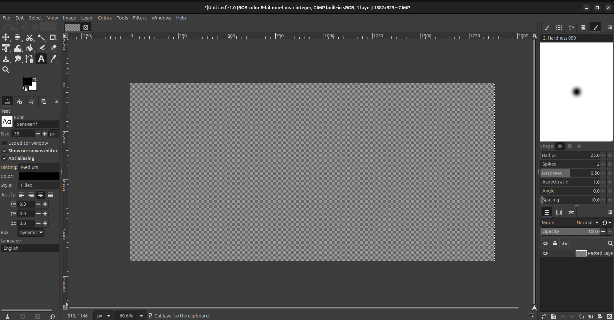
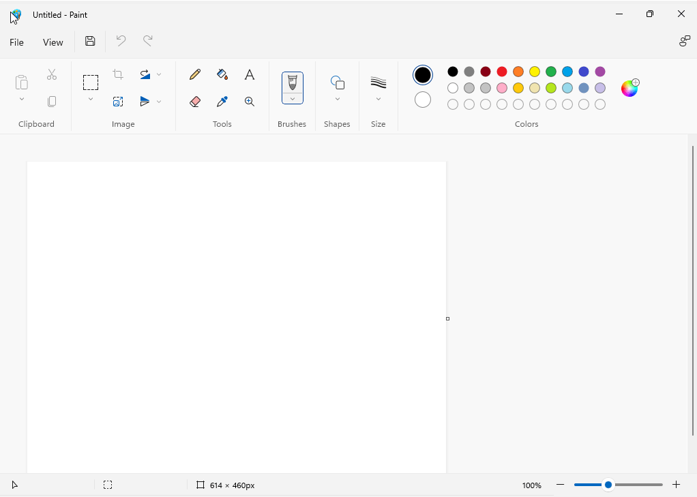

# Scale's Image Manipulation Program
https://www.bhasvic.ac.uk/media/pdf/computer-science-al-170844-specification-accredited-a-level-gce-computer-science-h446-874.pdf

---

## <u>Table of Contents</u>
- [Analysis of the Problem](#Analysis-of-the-Problem)
    - [Problem Identification](#Problem-Identification)
      - etc (fill this at the end, im sure intellij doesn't have a thing to auto fill it)

# Analysis of the Problem
## Problem Identification
I am creating an image manipulation program.
This is a type of program which allows the user to scale, crop, rotate and draw on existing images or a blank canvas to produce new images.
This project is amenable to computational methods due to the possibility of performing actions which are challenging on paper.
This includes erasing parts of an image and editing separate layers, which is why graphic design jobs require an image manipulation program.
The aim of this project is to create a program which is straightforward to learn and use, yet still capable of complex image manipulation.
Image manipulation programs are useful for professional jobs requiring image creation and tweaking as well as hobbyists pursuing creative projects.
Since the program is intended to be used by a wide range of people, responses from users are imperative to the success of the project.

## Stakeholders
My project is made to be used as a general purpose image manipulation project.
This means that there is variety in the skill level and features of my stakeholders which all need to be considered.
Both hobbyists and professionals need to be accounted for when creating the project; this means features should be easily accessible with a high skill ceiling.
Different fields of creativity, such as graphic designers and artists, can be accounted for separately; however, it is challenging to create a program simple enough for beginners and complex enough for experts.
### General Purpose
- Being able to draw and erase is useful for artists and designers
- Cropping and scaling images are useful outside creative jobs, such as teachers wanting to resize handouts.
- Adding text to images is desired for news publications creating a lead image
### Hobbyists
- They will require a simple GUI which is easy to navigate on first use
- Runs well on low-quality setups as hobbyists do not necessarily have good hardware
- Everything should be easy to understand without guides
- Functions should be intuitive with experimentation with configuration
### Professionals
- Each action should be configurable to meet any desires of the user
- Complex effects should be easily applicable to the image
- Documentation should be written to assist professionals in finding how their desired goal is achievable

## Research
### GNU Image Manipulation Program (GIMP)
GIMP is a popular open source image manipulation program which is capable of complex effects.
It allows the user to perform any image manipulation they can imagine, as simple as cropping and as complex as blur and antialiasing.
The program has 10 headers which each have hundreds of options below them which allow the user to alter the image in some way.
The sidebar contains 16 modes, each containing submodules, which, when clicked, change the operation the cursor performs.
All these settings mean that with enough practice there are more than enough tools to do whatever is needed to an image.
An issue with all this customisation is that the GUI is cluttered.
There is far too much showing on the screen, which makes navigating the GUI extremely difficult and overwhelming to new users.
Finding specific features is a chore as the headings have subheadings not particularly related to the heading.
Each setting is far too configurable with many of the settings not having a use case or explanation.
Some settings which are extremely useful are only able to enable by keybinds.
Switching your cursor to be able to draw with the "pencil" mode is only possible by pressing N, which is only shown to the user when they hover over the paintbrush icon.
The app does come with a help section, however, I believe that it should be possible to create a program which is intuitive and does not require a help tab.
The program is not lightweight, it takes several seconds to a minute to start up as well as not running particularly well.
Below is a screenshot of the program.

### Microsoft Paint
Microsoft's Paint program is the opposite end of the spectrum.
Paint is lightweight, launching without a noticable delay and features a very user friendly GUI.
It allows the user to draw on, crop, scale and rotate the image.
The GUI is very simple and easy to navigate, not requiring any help.
Paint is much less customizable than GIMP, features usually do not have many settings.
For example, when scaling an image, antialiasing is forcefully enabled, which can cause images to look blury.
Complex effects such as blurring are not a feature, and oddly opacity is applied seperately to the colour picker.
The GUI only features buttons at the top, which is compact and means you do not need to search through seperate GUI's to find the setting you are searching for.
Below is a screenshot of the program.

## Problem Solution
The research done prior has informed me of the possible pitfalls of my project.
GIMP struggles with user-friendliness due to its verbosity, having buttons not described and common features hidden from easy access.
Paint struggles with the opposite, all the features are easily accessible, however, it allows very little to be done, making some simple image manipulation hard or impossible.
The layout of Paint is very nice, however, I believe it is still bloated compared to the number of features provided. GIMP has many useful features which, while complicated at first, are required for a useful program.
I believe that GIMP’s idea of each button having sub-buttons is a good idea for the compactness of the GUI.
I believe the optional sub-settings should be accessible but not forced to be configured on each use.
For my solution to thrive, I will need to narrow down essential features.
### Essential Features
### Problem Limitations
The program is made with many different stakeholders' ideals at heart. 
They can each have conflicting desires, which makes it difficult to satisfy everyone.
Some users require a much wider range of specified features, which either are not essential or could take too much time. 
Since the program is being developed alone, time is a large limitation. 
Abstraction must be used to cull unnecessary features, and complex effects may be outside the timescale or outside my skill set. 
Image manipulation is a new field of research for me, which means that I will need to learn the basics for this project, which is another factor which takes time away.

### Success Criteria
<!-- todo: MORE -->
|   Criteria    | Description                                                             |
|:-------------:|-------------------------------------------------------------------------|
| User Friendly | The user should be able to use the program without any difficulty.      |
| Customisable  | The user should be able to configure the program to fit their use case. |
|   Efficient   | The program should be able to perform well without powerful hardware    |
|   Reliable    | The program should be able to perform well under extreme conditions.    |

# Design of the Solution
## Decomposition
<!-- todo: picture of decomposition..? what does this comment mean? -->

## Solution Description
### Justification of Structure

#### Creating Window

#### Handling Events

#### Manipulating Images

#### Saving Images

#### Controls

### Algorithms
[cool pseudocode or smth]

## Testing
[table of test, explanation, and expected result]

# Development
## Iterative Development Process
[Subheadings TBD, show all the code under relevant subheadings]

## Testing to Inform Development
[annotated evidence for testing!? and show "remedial" actions taken (how fancy)]

# Evaluation
## Testing to Inform Evaluation
### Functional Testing
[the word "robust" is really cool]

### Usability Testing
[user feedback]

## Success of the Solution
[wowow reference back to](#success-criteria)

## Description of the Final Product
[annotated picture, show the effectiveness of usability features]

## Maintenance and Development
### Maintainability

### Potential Extensions